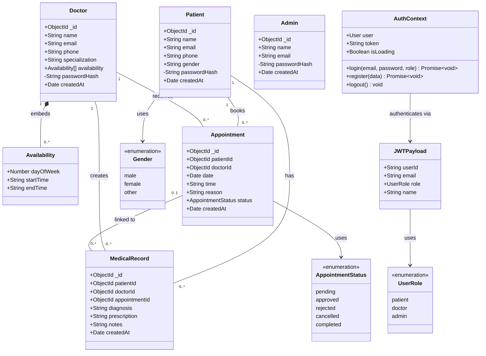

# Doctor Files — Class Diagram

## Mermaid Class Diagram

## Relationship Summary

| Relationship | Type | Description |
|---|---|---|
| Doctor → Availability | Composition (embedded) | Each doctor embeds an array of availability slots |
| Patient → Appointment | One-to-Many | A patient can book many appointments |
| Doctor → Appointment | One-to-Many | A doctor can receive many appointments |
| Patient → MedicalRecord | One-to-Many | A patient can have many medical records |
| Doctor → MedicalRecord | One-to-Many | A doctor can create many medical records |
| Appointment → MedicalRecord | One-to-Many (optional) | A medical record may optionally reference an appointment |

## Enumerations

| Enum | Values |
|---|---|
| `AppointmentStatus` | `pending`, `approved`, `rejected`, `cancelled`, `completed` |
| `Gender` | `male`, `female`, `other` |
| `UserRole` | `patient`, `doctor`, `admin` |

## Notes

- **Password Security**: All user models (`Patient`, `Doctor`, `Admin`) store a hashed password (`passwordHash`) which is excluded from JSON serialization via a `toJSON` transform.
- **Authentication**: JWT-based authentication with role-based access control (RBAC). Tokens carry a `JWTPayload` containing user ID, email, role, and name.
- **Indexes**: `Appointment` is indexed on `patientId`, `doctorId`, `date`, `status`, and a composite `(doctorId, date)`. `MedicalRecord` is indexed on `patientId`, `doctorId`, and composite `(patientId, createdAt)`. `Doctor` is indexed on `specialization`.
